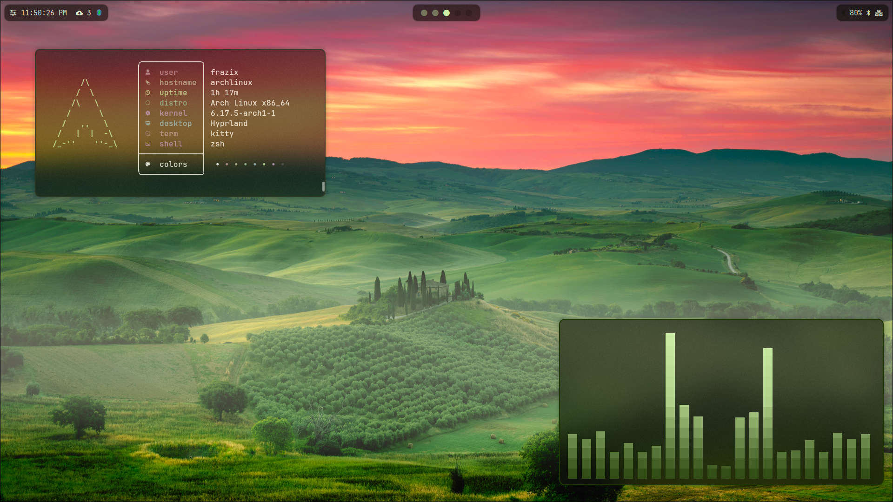

# Hyprland rice — Arch dotfiles



A small, opinionated rice for Arch Linux running Hyprland. This repository contains my personal dotfiles (managed with chezmoi) and a lightweight Hyprland setup tuned for a clean, minimal desktop.

## What you'll find

- Hyprland configuration and rules
- Waybar/Wayland widgets and styles
- Kitty/terminal theme and config
- GTK theming tweaks and helper scripts
- Small helper scripts for wallpapers, notifications, and startup

## Requirements

- Arch Linux (or Arch-based) with a working Wayland session
- Hyprland
- A compositor-capable GPU driver and Wayland support
- Optional: `chezmoi` if you want to apply these dotfiles directly

## Quick install (chezmoi)

If you manage dotfiles with `chezmoi`, you can apply this repository's files (replace the repo URL with yours):

```bash
# initialize and apply from a git repo (example)
chezmoi init --apply git@github.com:Frazix12/dots.git
```

Or manually copy the pieces you want from the `dot_config/` folder into your home config directory.

## License

Personal dotfiles — feel free to use ideas, but no guarantees. Open to PRs and suggestions.
